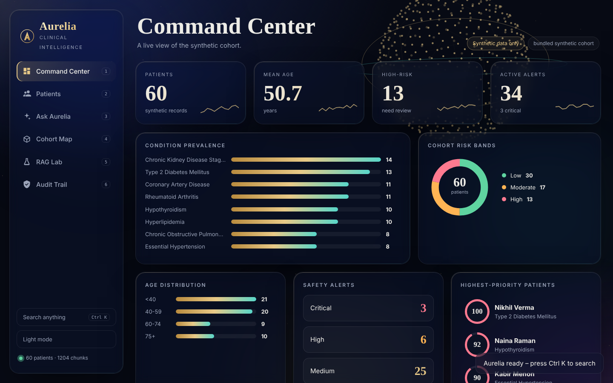
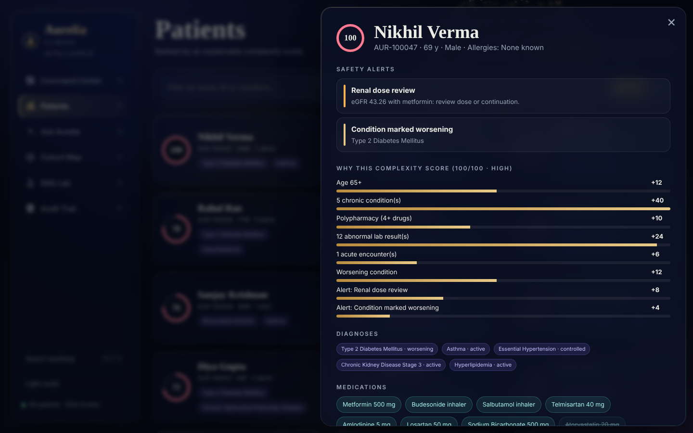
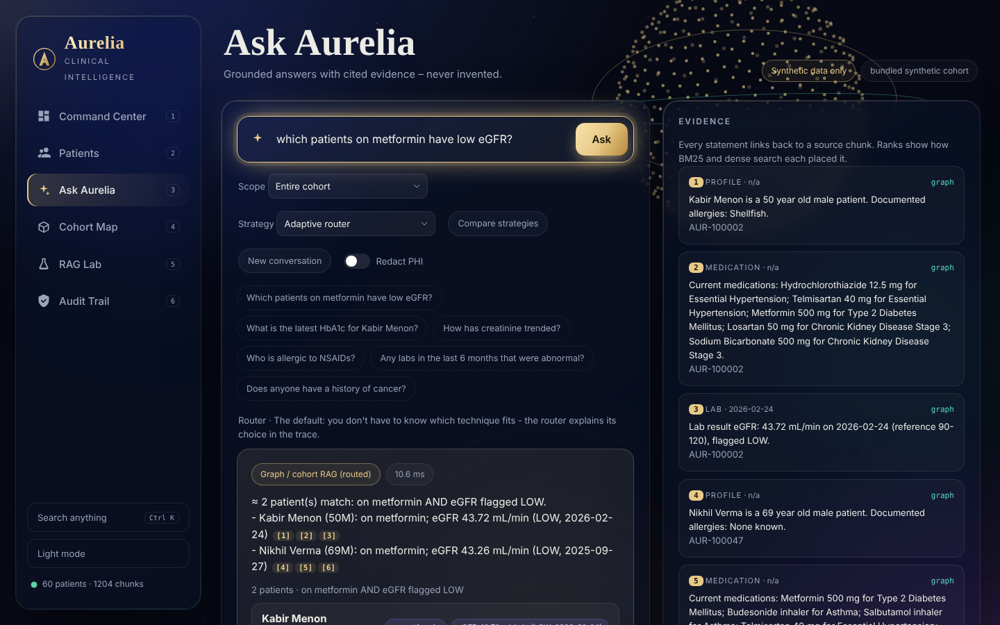
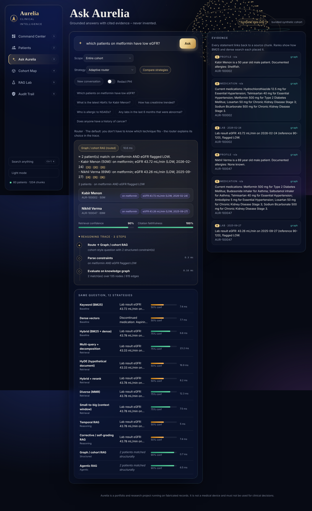
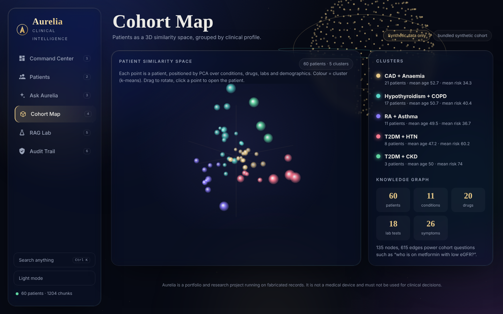
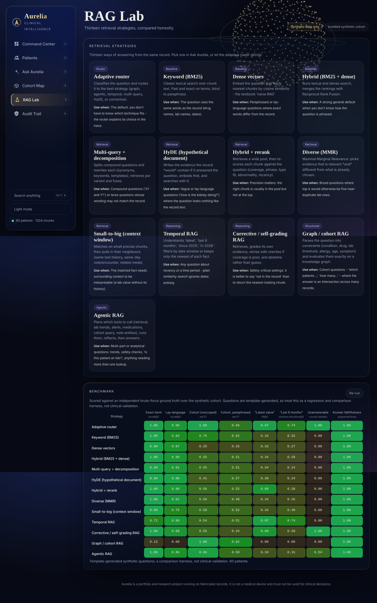
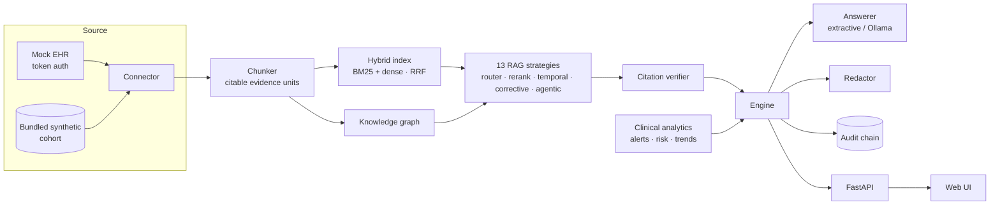

<div align="center">

# ✦ Aurelia

**A clinical intelligence workspace: 13 RAG strategies, a knowledge graph, agentic tool use, self‑verifying answers and a tamper‑evident audit trail.**

   



</div>

> **Aurelia runs entirely on fabricated records.** It is a portfolio and research project, not a medical device, and must not be used for clinical decisions.

## What it does

Ask a question in plain language about a patient (or the whole cohort) and Aurelia retrieves the relevant parts of the record, answers **only from that evidence**, and shows exactly which excerpts support each statement.

| Capability | How it works |
|---|---|
| **13 RAG strategies** | Adaptive router, BM25, dense, hybrid (RRF), multi‑query, HyDE, rerank, MMR, small‑to‑big, temporal, corrective (self‑grading, abstains), graph/cohort and agentic RAG – see [docs/RAG.md](docs/RAG.md) |
| **Reasoning trace** | Every answer shows the steps taken: routing, rewrites, retrieval, grading, tool calls |
| **Citation verification** | Each answer line is checked against the evidence it cites; the UI shows a faithfulness score |
| **Abstention** | When evidence doesn't cover the question, Aurelia says so instead of returning the nearest chunk |
| **Conversational memory** | Short follow‑ups ("and in the last 6 months?") inherit modifiers from the previous turn |
| **Knowledge graph** | Patients, conditions, drugs, labs and symptoms for exact cohort questions ("on metformin with low eGFR") |
| **Clinical NLP** | Negation‑aware symptom extraction from notes ("denies palpitations but reports fatigue") |
| **Patient AI** | Similar‑patient search, k‑means cohorts on a draggable 3D map, lab forecasts with prediction intervals, robust anomaly detection |
| **Hybrid retrieval** | BM25 + dense vectors fused with Reciprocal Rank Fusion; patient‑scoped filtering that cannot leak across patients |
| **Grounded, cited answers** | Extractive answerer composes responses from retrieved chunks with `[n]` citations; optional local LLM (Ollama) with automatic fallback |
| **Clinical safety alerts** | Transparent rules: drug–allergy conflicts, hyperkalaemia risk with ACEi/ARB, renal dose review, poor glycaemic control, low SpO₂, severe anaemia |
| **Explainable complexity score** | 0–100 additive score; the UI shows every factor and its points – no black box |
| **Lab trends** | Per‑test sparklines against reference ranges with rising / falling / stable detection |
| **PHI redaction** | One toggle masks names, MRNs, phones, emails and clinician names in answers and evidence |
| **Tamper‑evident audit log** | Each entry stores the SHA‑256 of the previous one; editing any line breaks verification. Question text is never stored, only its length |
| **Mock EHR service** | Token‑authenticated `/v1/patients` API over synthetic data, so the whole ingestion path runs with no real system |
| **Evaluation harness** | Eight suites scored against an independent brute‑force ground truth, for all 13 strategies; results shown live in the RAG Lab |
| **Interface** | Glassmorphism design, 3D particle globe, tilt cards, command palette (`Ctrl K`), dark/light themes, keyboard shortcuts, reduced‑motion support |

<div align="center">







</div>

## Architecture



See [docs/ARCHITECTURE.md](docs/ARCHITECTURE.md) for design decisions and trade‑offs.

## Quick start

```bash
git clone <your-repo-url> aurelia && cd aurelia
python -m venv .venv && source .venv/bin/activate      # Windows: .venv\Scripts\activate
pip install -e ".[dev]"
aurelia serve                                           # http://127.0.0.1:8000
```

Run the full two‑service setup (workspace ingesting from the mock EHR over HTTP):

```bash
docker compose up --build        # workspace :8000 · mock EHR :8100
# or without Docker:
aurelia mock-ehr &               # :8100
AURELIA_EHR_URL=http://localhost:8100 aurelia serve
```

Other commands: `make test` · `make eval` · `make lint`. Configuration lives in [`.env.example`](.env.example).

### Optional: local LLM

```bash
ollama pull llama3.1
AURELIA_LLM=ollama aurelia serve
```

The model receives only the retrieved evidence and a grounding prompt. If Ollama is unreachable Aurelia silently falls back to the extractive answerer.

## API

| Method | Path | Purpose |
|---|---|---|
| `GET` | `/api/health` | Status, patient and chunk counts |
| `GET` | `/api/patients?q=&sort=risk\|name` | Patient list with risk and alert counts |
| `GET` | `/api/patients/{id}` | Profile, labs and trends, alerts, risk factors, timeline |
| `POST` | `/api/query` | `{question, patient_id?, strategy, history[], k, redact}` → answer, evidence, trace, confidence, faithfulness |
| `POST` | `/api/compare` | Run one question through every strategy |
| `GET` | `/api/strategies` | Strategy catalogue |
| `GET` | `/api/patients/{id}/similar` | Nearest patients by clinical profile |
| `GET` | `/api/cohort/map` | 3D PCA coordinates and k‑means clusters |
| `GET` | `/api/graph` | Knowledge graph statistics |
| `GET` | `/api/benchmark` | Cached benchmark results (`?refresh=true` recomputes) |
| `GET` | `/api/cohort` | Cohort statistics |
| `GET` | `/api/audit` | Recent entries and chain verification |

Interactive docs at `/docs`. Set `AURELIA_API_KEY` to require an `X-API-Key` header.

## Evaluation

`python -m eval.benchmark` – questions and gold labels are generated from the structured records and checked against an independent brute‑force computation. Higher is better in every cell (abstention column = correct‑abstain rate on unanswerable questions).

| Strategy | Exact-term questions <br><sub>recall@5, n=200</sub> | Lay-language questions <br><sub>recall@5, n=77</sub> | Cohort questions (unscoped) <br><sub>set F1, n=40</sub> | Cohort questions, paraphrased <br><sub>set F1, n=16</sub> | “Latest value” questions <br><sub>hit@1, n=80</sub> | “Last 6 months” questions <br><sub>window precision@5, n=60</sub> | Unanswerable questions <br><sub>correct abstain, n=200</sub> | Answer faithfulness <br><sub>supported lines, n=100</sub> |
|---|---|---|---|---|---|---|---|---|
| Adaptive router | 1.00 | 0.90 | 1.00 | 0.66 | 0.97 | 0.74 | 1.00 | 1.00 |
| Keyword (BM25) | 1.00 | 0.82 | 0.75 | 0.62 | 0.33 | 0.32 | 0.00 | 1.00 |
| Dense vectors | 0.99 | 0.87 | 0.25 | 0.26 | 0.33 | 0.27 | 0.00 | 1.00 |
| Hybrid (BM25 + dense) | 1.00 | 0.90 | 0.55 | 0.51 | 0.34 | 0.28 | 0.00 | 1.00 |
| Multi-query + decomposition | 0.99 | 0.91 | 0.55 | 0.51 | 0.34 | 0.24 | 0.00 | 1.00 |
| HyDE (hypothetical document) | 0.99 | 0.96 | 0.41 | 0.57 | 0.39 | 0.24 | 0.00 | 1.00 |
| Hybrid + rerank | 1.00 | 0.90 | 0.56 | 0.52 | 0.89 | 0.28 | 0.00 | 1.00 |
| Diverse (MMR) | 1.00 | 0.91 | 0.50 | 0.48 | 0.34 | 0.26 | 0.00 | 1.00 |
| Small-to-big (context window) | 0.99 | 0.75 | 0.58 | 0.52 | 0.34 | 0.40 | 0.00 | 1.00 |
| Temporal RAG | 0.72 | 0.90 | 0.54 | 0.51 | 0.97 | 0.74 | 0.00 | 1.00 |
| Corrective / self-grading RAG | 1.00 | 0.88 | 0.55 | 0.34 | 0.89 | 0.28 | 1.00 | 1.00 |
| Graph / cohort RAG | 0.12 | 0.00 | 1.00 | 0.82 | 0.00 | 0.00 | 0.00 | 1.00 |
| Agentic RAG | 1.00 | 0.86 | 0.96 | 0.59 | 0.34 | 0.31 | 0.54 | 1.00 |

**What this does and doesn't show**

- No strategy wins everywhere. Keyword search is already perfect on exact‑term questions; hybrid and HyDE help on lay language; temporal RAG is the one that handles "latest" and date windows; graph RAG is exact for cohort questions but useless for free text. The **adaptive router** picks per question and is the best or tied‑best in most columns.
- Paraphrased cohort questions are hard: the router drops from 1.00 to 0.66 F1 because wording the parser doesn't recognise falls back to retrieval. That's the honest ceiling of a rule‑based parser.
- Faithfulness is ~1.0 mostly *by construction* – answers are extractive, so they can only quote the evidence. It becomes a meaningful check once an LLM writes the answer.
- Questions are template‑generated on synthetic data: a regression and comparison harness, **not** evidence of real‑world clinical accuracy.

## Project layout

```
src/aurelia/
  ingestion/   connector (HTTP or in‑process) · chunker
  retrieval/   embeddings · BM25 · hybrid index
  rag/         13 strategies · graph · rerank · verifier · agent · conversation
  nlp/         negation‑aware clinical NER
  analytics/   alerts · risk · trends · forecast · patient similarity
  llm/         extractive and Ollama answerers
  security/    PHI redaction · hash‑chained audit log
  api/         FastAPI app          engine.py   orchestration
mock_ehr/      synthetic generator + token‑auth EHR service
ui/static/     index.html · styles.css · app.js (no build step)
eval/          retrieval benchmark   tests/   41 pytest tests
```

## Limitations

- **Synthetic data only.** Distributions are simplified and do not reflect real patient populations.
- The default embedder is a hashing TF‑IDF model with a small clinical synonym table. It is fast and offline but weaker than a trained biomedical encoder; `sentence-transformers` can be dropped in behind the same interface.
- The reranker is a transparent feature‑based heuristic standing in for a learned cross‑encoder; HyDE uses templates unless a local LLM is configured.
- Alerts and the complexity score are readable demonstration heuristics, **not validated clinical decision support**.
- Redaction is pattern‑based and not a certified de‑identification method.
- The audit chain proves tampering within the file; it does not replace write‑once storage or access control.
- No authentication beyond an optional API key – put it behind a real identity provider before any shared deployment.

## Roadmap

Trained biomedical encoder and learned cross‑encoder · LLM‑based answer synthesis with the verifier as a guard · FHIR R4 connector · role‑based access.

## Contributing

See [CONTRIBUTING.md](CONTRIBUTING.md) · [CHANGELOG](CHANGELOG.md) · [SECURITY](SECURITY.md).

## License

MIT – see [LICENSE](LICENSE).
